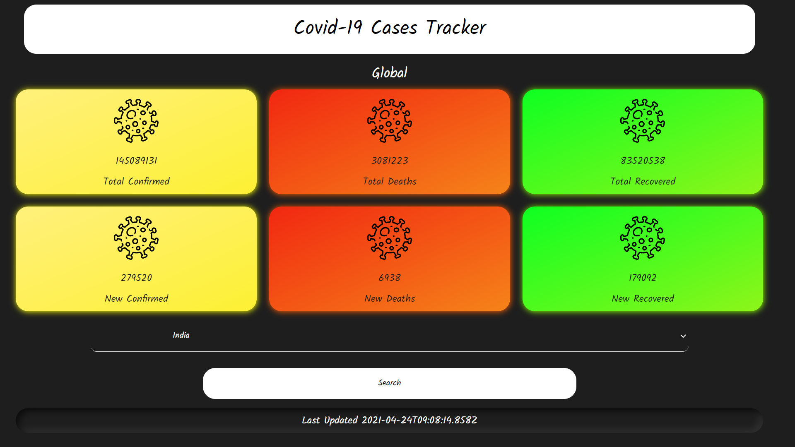

## Covid 19 Cases Tracker
## Click on the link below to access the live covid19 cases tracker. 
### [Covid19 Cases Tracker](https://sagar-sharma-7.github.io/Covid19-Tracker-Countries/)

<hr>

## Here are some screen shots

<p align="center">
  
  <br>
  
</p>

<hr>

## Editor used 


## Built with 
 
 
 
 
 

 <hr>

 ## Cloning this repositary using command line
 1. Open **Git Bash**.
 1. Change the current working directory to the location where you want the cloned directory.
 1. Type `git clone https://github.com/priti163/Covid_19-tracker.git`
 1. Press **Enter** to create the clone of this repositary.

 <hr>

## Font used 
```css 
@import url('https://fonts.googleapis.com/css2?family=Kalam&display=swap');

div{
    font-family: 'Kalam', cursive;
}
```

## API used
```
https://api.covid19api.com/summary
```


  
<hr>


<hr>

 ## How to reach me?
 [ ](mailto:official360priti@gmail.com)
 <hr>
 <br>

[](https://github.com/priti163)
 <hr>
 <p float="left">

[](https://github.com/priti163)
[ ](https://github.com/priti163)

</p>


[](https://github.com/priti163)


